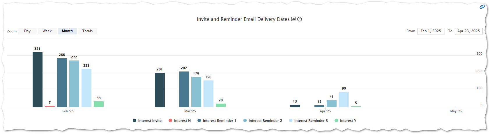

# Research Match Batch History

How to understand your batch history, participant response and activity.

Example Interest Timeline

Insight Timeline charts are all interactive

 - hover over a chart element to get detailed information for that time slice - note: by default the timeline chart summarizes data by month, but you can easily change the grouping by clicking on the top left zoom level of: Day, Week, Month, or Totals by Year

hover detail example

