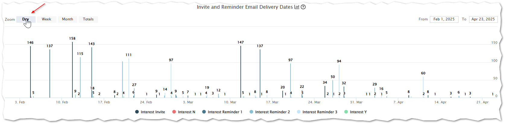
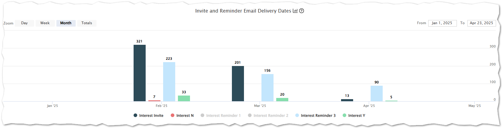
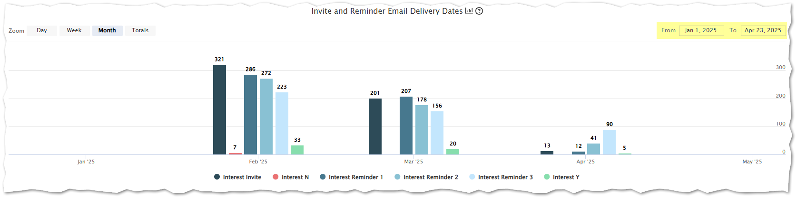

# Research Match Batch History

How to understand your batch history, participant response and activity.

Example Interest Timeline

Insight Timeline charts are all interactive

 - hover over a chart element to get detailed information for that time slice - note: by default the timeline chart summarizes data by month, but you can easily change the grouping by clicking on the top left zoom level of: Day, Week, Month, or Totals by Year

hover detail example

zoom level example, change to Day

hover detail example on the Day zoom level

zoom Total will show counts by year

legend entries can be toggled on/off by clicking on them

specific date ranges can also be specified

### [Learn more about Research Match Batch Request](https://researchmatch-docs.tempusresearch.com/batch-request)