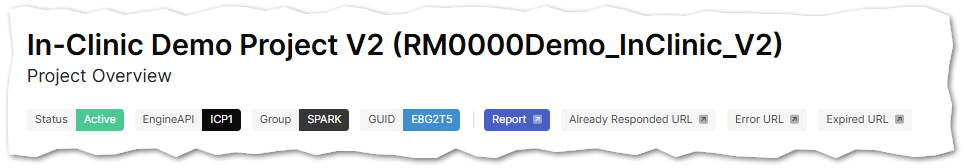

# Research Match Status Dashboard

## What is the Insight Status Dashboard and how do I access it?

The insight status dashboard is your live monitoring and reporting page for your project. It will show each sequence of your workflow along with information about that sequence.

You can access your insight status dashboard by logging into the Synapse Admin Portal.

[https://synapse.tempusresearch.com/recontacting/projects](https://synapse.tempusresearch.com/recontacting/projects)

Click on the study or project you wish to see details for, then click on the blue Dashboard link

## How do I monitor my SPARK Research Match project using the Insight Status dashboard?

Each project workflow consists of sequences, or steps for your particular project.

Participants for your study will either be available to invite or have sequence activity.

Sequence level activity is typically shown on a timeline as well as Responses chart.

*If you have further questions about your Insight Status Dashboard contact [Ben@TempusDynamics.com](mailto:Ben@TempusDynamics.com)*

### Example workflow and how Insight will display information for your study.

Let's say we have a workflow that includes an Interest, Authorization and Contact Info sequences. Each sequence will have the timeline and responses chart as shown below.

