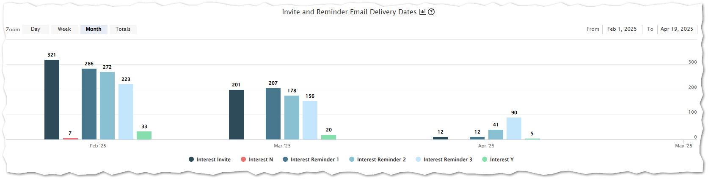
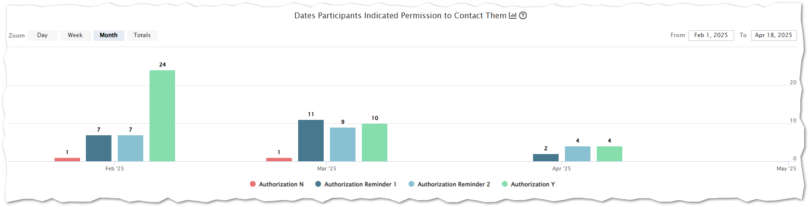

# Timeline Chart

Example of an Interest Timeline chart
		

 - The chart above displays the timeline and counts of when invitation and reminders emails were sent.
	 -   When a participant receives an invitation email, they can respond "Yes" or "No" to learning more about the study.
     -   If a participant does not respond to the invitation email, they will be sent up to 3 reminder emails.
 - The chart above displays the timeline and counts of when invitation and reminders emails were sent.
 - The vertical axis displays the number of invitations and reminder emails sent.
 - The chart allows you to break down the invitations by day, week, month and total overall.
     -   For example in Febuary 2025:
     - 321 invites were sent to participants (Interest Invite).
     - 7 were declined (Interest N).
     - 286 reminders were sent to non responders (Interest Reminder 1).
     - 272 second reminders were sent (Interest Reminder 2).
     - 223 third reminders were sent (Interest Reminder 3).
     - 33 invites were accepted. (Interest Y).

Example of a Sequence Timeline chart

 - This example shows a timeline of study sequence completions.
	 - In this case, an Authorization form for a clinical study.
 - A sequence can be anything from an Authorization form, a Consent, study surveys, or any other online form you wish for the participant to fill out.
 - This chart is broken down into two reminder emails and ‘Authorization Y’ displaying the participant submitted their authorization for the study.