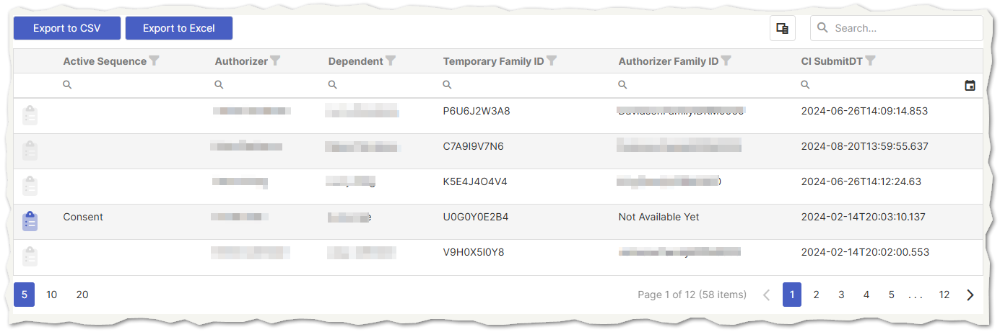
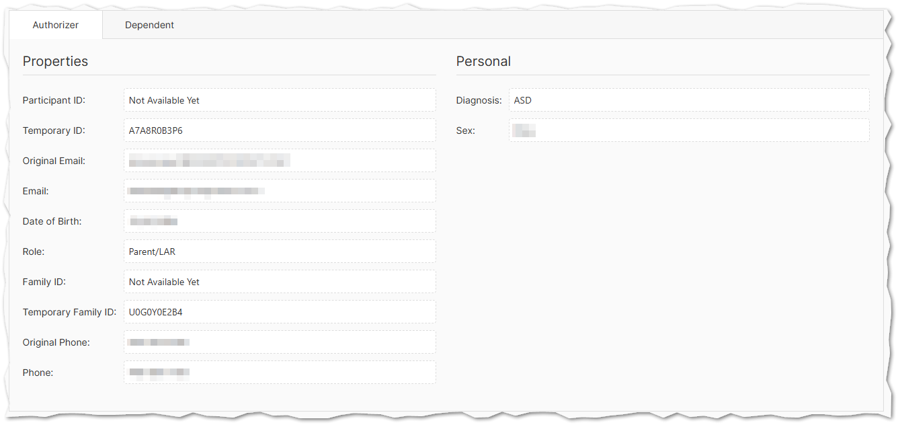

# Researcher Views

The authorizers tab lists a selection of customizable Researcher Views that provide access to authorizers, dependents, or other data within a project. By default, researcher views include export buttons to pull all participant data into Excel or CSV files, as well as a column selection interface to customize the data that is displayed in the table. Each field is also searchable and sortable. To the far left, a convenient link is included to the current active sequence for the authorizer (if any).

Clicking on any row in the table opens a details panel within the researcher view that provides access to additional informational about the authorizer and dependent in two distinct tabs.

!!!
Editing functionality may be enabled on researcher views by request but is disabled by default.
!!!

