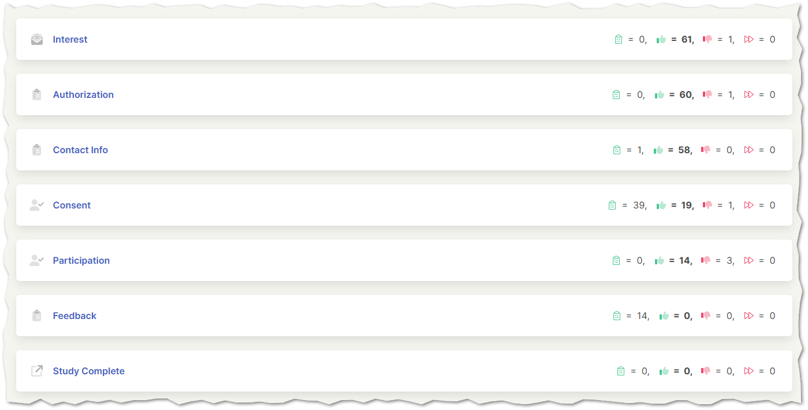

# Sequences

The Sequences interface lists each of the sequences within a project, including a quick summary of users who are currently on a sequence, responded yes or completed the sequence, responded no or were screened out, and were bypassed, respectively. Further details about each specific sequence can be accessed by clicking on the name of each sequence.

Typically, a sequence corresponds to a specific "action" within the project, such as the sending of the initial interest email, assignment of a survey, awarding of an incentive, or completion of the project. Other sequence types may be used for more complex and custom functionality as the needs of the specific project dictate.

*Bypassed users are typically only seen for projects or sequences that have been shut down after a specific time frame. This amount represents the number of users who were still active at the time the project or sequence was shut down.*

The sequence details page provides more specific information including a dashboard/codebook link (for surveys), the assignment of the sequence, redirect links (if any), response counts, and a list of email communications used in the project. Clicking on the name of a specific communication opens a new tab with a preview of the email template's contents.

