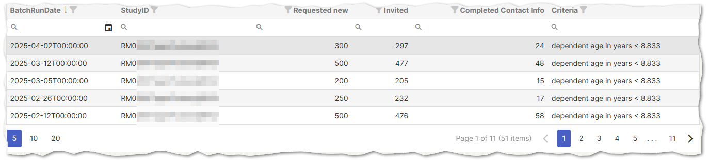
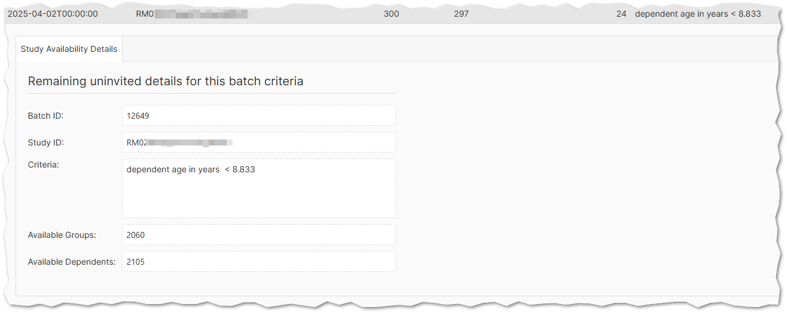
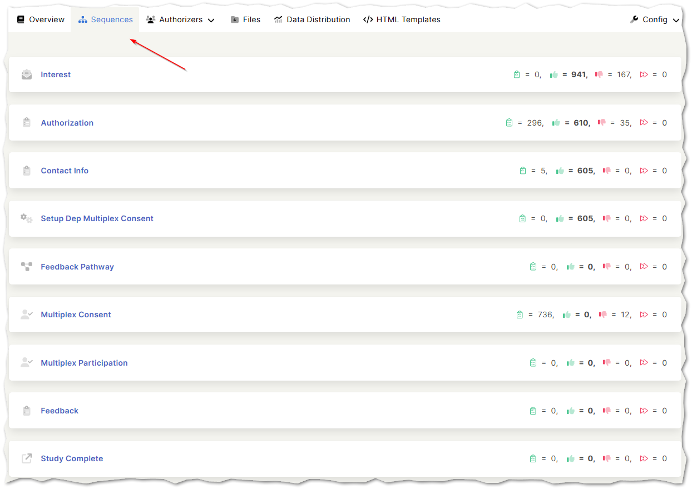

# Batch History
Use the link in your email to open your study batch history.

Your batch history researcher view is in the Synapse Admin Portal and will look similar to the one below.

Clicking on a batch history row will open the details about that batch request.

Here you will see the criteria used for that batch request, how many available authorizer groups and how many available dependents in your study are eligible to invite based on that criteria.

You can have multiple different batch criteria, and if your project needs these setup just let us know and we will add batch history templates that you can use.

## Synapse Admin Portal Sequences

You can also easily look at the sequence level completion rate for your study from the Sequences tab.

