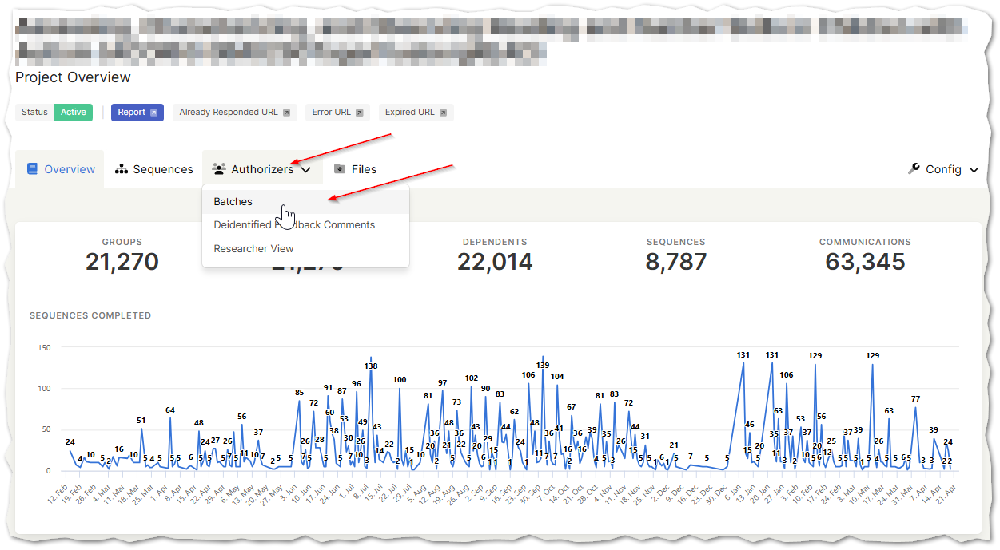
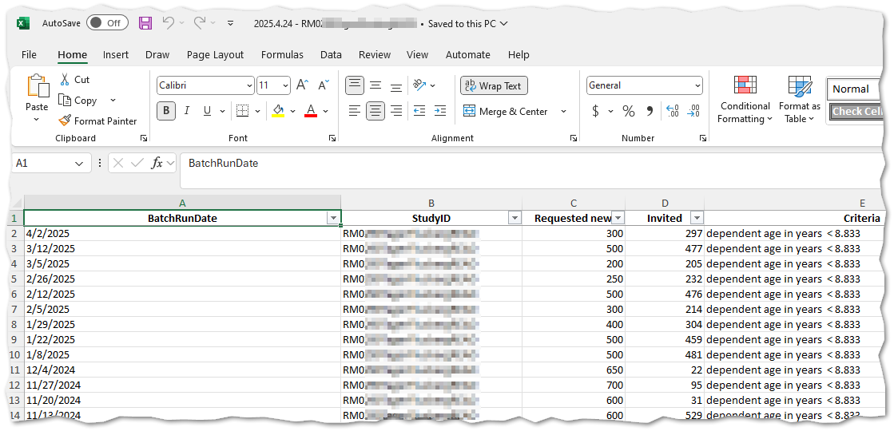

# Download Batch History

You can download your batch history following these steps.

Log into the [Synapse Admin Portal](https://synapse.tempusresearch.com/recontacting/projects) and select your project

Select the Batches from the Authorizers drop down

Click on the Export to Excel button above the data grid.

This will download to your PC default download location an excel file with your batch history.

